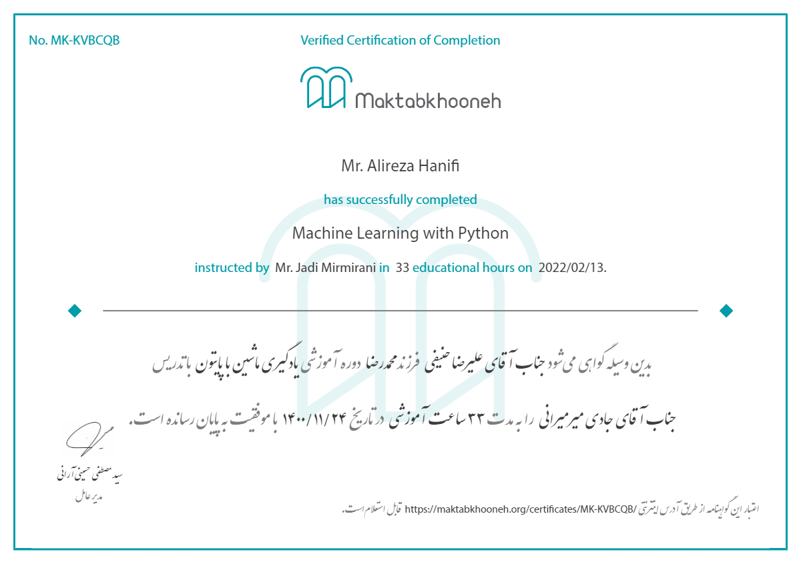

Hi!
My projects from [Machine Learning with Python](https://maktabkhooneh.org/course/%DB%8C%D8%A7%D8%AF%DA%AF%DB%8C%D8%B1%DB%8C-%D9%85%D8%A7%D8%B4%DB%8C%D9%86-%D9%BE%D8%A7%DB%8C%D8%AA%D9%88%D9%86-mk1318/)'s course are collected here. The list of projects is as follows:
1. Predicting house prices (A regression project).
2. Classifying heart attack (A binary classification project).
3. Customer segmentation (A clustering project).
4. Movie recommendation system (A recommendation system project).

